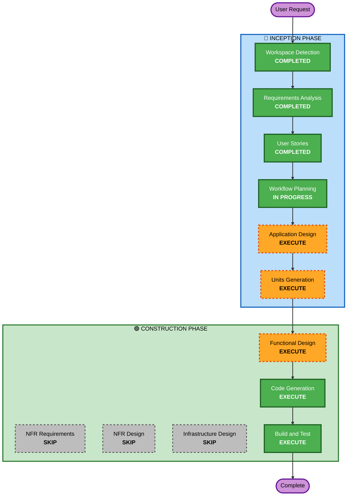

# Execution Plan — 테이블오더 서비스

## Detailed Analysis Summary

### Change Impact Assessment
- **User-facing changes**: Yes — 고객용 주문 UI, 관리자용 대시보드 신규 개발
- **Structural changes**: Yes — 프론트엔드 2개 + 백엔드 + DB 신규 아키텍처
- **Data model changes**: Yes — 매장, 테이블, 메뉴, 카테고리, 주문, 주문이력 등 신규 스키마
- **API changes**: Yes — REST API 전체 신규 설계
- **NFR impact**: Yes — SSE 실시간 통신, JWT 인증, 서버 캐싱

### Risk Assessment
- **Risk Level**: Medium
- **Rollback Complexity**: Easy (신규 프로젝트, 기존 시스템 없음)
- **Testing Complexity**: Moderate (SSE 실시간 통신, 세션 관리 테스트 필요)

---

## Workflow Visualization



### Text Alternative
```
INCEPTION PHASE:
  1. Workspace Detection     — COMPLETED
  2. Requirements Analysis   — COMPLETED
  3. User Stories            — COMPLETED
  4. Workflow Planning       — IN PROGRESS
  5. Application Design     — EXECUTE
  6. Units Generation       — EXECUTE

CONSTRUCTION PHASE (per-unit):
  7. Functional Design      — EXECUTE
  8. NFR Requirements       — SKIP
  9. NFR Design             — SKIP
  10. Infrastructure Design — SKIP
  11. Code Generation       — EXECUTE
  12. Build and Test        — EXECUTE
```

---

## Phases to Execute

### 🔵 INCEPTION PHASE
- [x] Workspace Detection (COMPLETED)
- [x] Requirements Analysis (COMPLETED)
- [x] User Stories (COMPLETED)
- [x] Workflow Planning (IN PROGRESS)
- [ ] Application Design — EXECUTE
  - **Rationale**: 신규 프로젝트로 컴포넌트 식별, 서비스 레이어 설계, 데이터 모델 정의가 필요
- [ ] Units Generation — EXECUTE
  - **Rationale**: 프론트엔드 2개 + 백엔드 + DB로 다중 유닛 분해가 필요

### 🟢 CONSTRUCTION PHASE (per-unit)
- [ ] Functional Design — EXECUTE
  - **Rationale**: 신규 데이터 모델, 복잡한 비즈니스 로직(세션 관리, 주문 상태), API 설계 필요
- [ ] NFR Requirements — SKIP
  - **Rationale**: 보안 확장 규칙 미적용(B), MVP 로컬 개발 환경, 별도 NFR 요구사항 없음
- [ ] NFR Design — SKIP
  - **Rationale**: NFR Requirements 스킵에 따라 자동 스킵
- [ ] Infrastructure Design — SKIP
  - **Rationale**: MVP 로컬 개발 환경만 사용, 클라우드 인프라 불필요
- [ ] Code Generation — EXECUTE (ALWAYS)
  - **Rationale**: 실제 코드 구현 필수
- [ ] Build and Test — EXECUTE (ALWAYS)
  - **Rationale**: 빌드 및 테스트 지침 필수

### 🟡 OPERATIONS PHASE
- [ ] Operations — PLACEHOLDER

## Success Criteria
- **Primary Goal**: 테이블오더 MVP 서비스 구현 (고객 주문 + 관리자 모니터링)
- **Key Deliverables**: React 고객앱, React 관리자앱, Spring Boot API, MySQL 스키마, Flyway 마이그레이션
- **Quality Gates**: 모든 User Story의 Acceptance Criteria 충족
